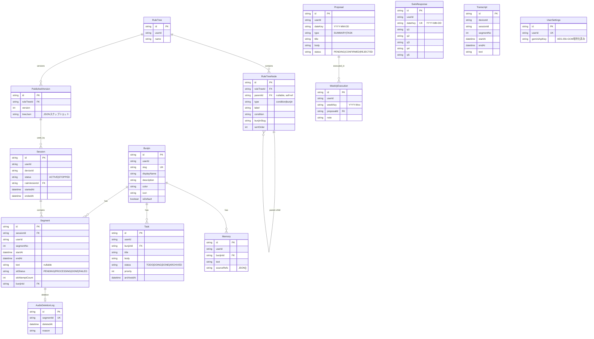

# データベース設計

14モデル構成。Prisma 6 + Neon PostgreSQL (Serverless)。

## ER図



## テーブル一覧

| テーブル | 用途 | 備考 |
|---------|------|------|
| `transcripts` | 文字起こし結果 (レガシー) | v1.4.1以前。新規は `segments` を使用 |
| `bunjins` | 分人 (人格ファセット) | デフォルト5 + カスタム最大3 = 計8 |
| `rule_trees` | ルールツリー (条件分岐) | ユーザーごとに1つ |
| `rule_tree_nodes` | ルールツリーノード | 自己参照で親子関係。深度制限10 |
| `published_versions` | 公開バージョン | ルールツリーのJSONスナップショット |
| `sessions` | 録音セッション | ACTIVE / STOPPED |
| `segments` | 音声セグメント | Transcript後継。STT状態管理付き |
| `proposals` | AI提案 | SUMMARY / TASK の2タイプ |
| `tasks` | タスク | TODO → DOING → DONE → ARCHIVED |
| `weekly_executions` | 週次実行記録 | 提案の週次レビュー追跡 |
| `swls_responses` | SWLS回答 | 主観的幸福度5問 (日次1回) |
| `memories` | メモリー | 学習記録。追加のみ (append-only) |
| `user_settings` | ユーザー設定 | Gemini APIキーのAES-256-GCM暗号化保存 |
| `audio_deletion_logs` | 音声削除ログ | STT完了後の音声削除追跡 |

## 主要な制約とインデックス

- `bunjins`: `@@unique([userId, slug])` — ユーザーごとにslugは一意
- `published_versions`: `@@unique([ruleTreeId, version])` — バージョン番号は一意
- `swls_responses`: `@@unique([userId, dateKey])` — 日次1回のみ
- `weekly_executions`: `@@unique([userId, weekKey, proposalId])` — 週次実行は重複不可
- `audio_deletion_logs`: `@unique segmentId` — セグメントごとに1レコード
- 全テーブルに `userId` インデックスあり

## タスク状態遷移マトリクス

```
FROM\TO   | TODO | DOING | DONE | ARCHIVED
----------|------|-------|------|----------
TODO      |  -   |  OK   |  NG  |   OK
DOING     |  OK  |  -    |  OK  |   OK
DONE      |  OK  |  NG   |  -   |   OK
ARCHIVED  |  NG  |  NG   |  NG  |   -
```

- **ARCHIVED は最終状態**（復帰不可）
- DONE → TODO は許可（やり直し）
- DONE → DOING は禁止
- 14日以上更新なしのタスクは自動アーカイブ (`/api/cron/archive-tasks`)

## Segment STTステータス遷移

```
PENDING → PROCESSING → DONE
                    ↘ FAILED
```

- PROCESSING遷移時: `sttAttemptCount` を自動インクリメント

## MOCK_USER_ID 同期ルール

以下3箇所で `mock-user-001` を一致させること:

1. `lib/constants.js` — バックエンド全API
2. `flutter_app/lib/core/constants.dart` — Flutterアプリ
3. `prisma/seed.mjs` — 初期データ投入

## デフォルト分人

| slug | 表示名 | 色 | アイコン | 説明 |
|------|--------|-----|---------|------|
| work | 仕事モード | #3b82f6 | work | 業務・プロジェクト関連 |
| creative | クリエイティブ | #8b5cf6 | palette | 創作・アイデア出し |
| social | ソーシャル | #ec4899 | people | 対人関係・コミュニケーション |
| rest | 休息 | #10b981 | self_improvement | リラックス・回復 |
| learning | 学習 | #f59e0b | school | 勉強・スキルアップ |

seed実行時に5件作成。カスタム分人は最大3件追加可能（計8件上限）。

## 関連ナレッジ

- 参照: `overview.md` — プロジェクト概要・アーキテクチャ
- 参照: `api-surface.md` — APIエンドポイント仕様
