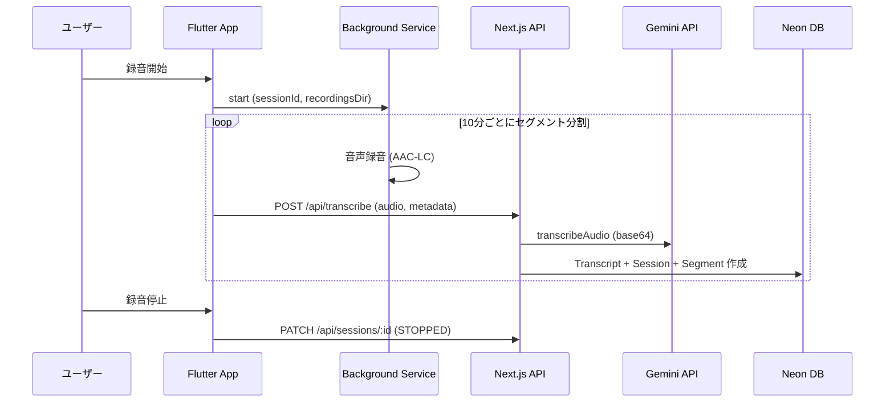
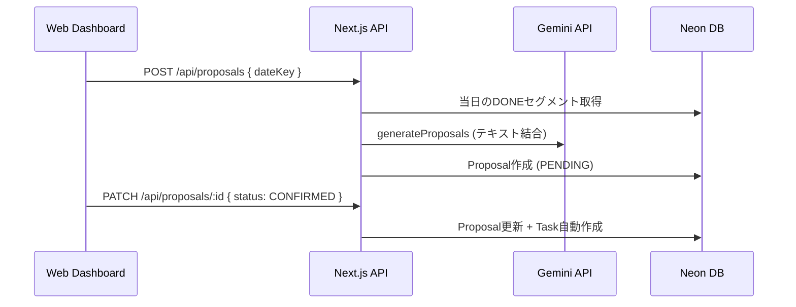

# record-app 概要

音声録音 → 自動文字起こし → AI提案生成 を軸とした自己管理アプリ。
「分人（Bunjin）」という人格ファセット概念で、状況に応じた自己の使い分けを支援する。

## Tech Stack

| 領域 | 技術 | バージョン |
|------|------|-----------|
| Web Framework | Next.js (App Router) | 15.x |
| React | React 19 | 19.x |
| ORM | Prisma | 6.2.x |
| Database | PostgreSQL (Neon Serverless) | - |
| AI/ML | Google Generative AI (Gemini 2.0 Flash) | 0.24.x |
| Flutter | Flutter SDK | >=3.10.0 |
| 状態管理 | Riverpod | 2.6.x |
| 録音 | record パッケージ | 5.2.x |
| バックグラウンド | flutter_background_service | 5.0.x |
| ローカルDB | sqflite | 2.4.x |
| ホスティング | Vercel (Serverless) | - |
| APK配布 | GitHub Releases | - |

## Core Concept: 分人（Dividual）

24時間（16時間セッション）バックグラウンド録音。ユーザーは朝Startを押すだけで、
アプリが終日耳を傾ける。各分人（仕事/家庭/自分/コミュニティ/自由枠）に
「今日何があったかを全て把握している執事」が生まれる。

### 1日のフロー

```
朝（10秒）   Startボタン → バックグラウンド録音開始
終日（0秒）   自動で録音・分割・STT・分人割当が回り続ける
夕方（2分）   録音停止 → 執事が蒸留 → 提案を承認/却下
週末（5分）   「やったか？」Yes/No → 崩れパターンが見える
```

### UX体験定義（E1-E5）

| # | 体験 | 概要 |
|---|------|------|
| E1 | 常に聴いている | 16時間バックグラウンド録音。10分/無音で自動分割 |
| E2 | 分人別に整理される | ルールツリーで自動分人割当 |
| E3 | 執事が一手を出す | 1日分のテキストを蒸留しAIが最小アクション提案 |
| E4 | 軽く振り返る | 「やったか？」にYes/Noで答えるだけ |
| E5 | 執事が育つ | 採用メモリーが蓄積（append-only、新情報優先） |

## システム構成図

```mermaid
graph TB
    subgraph Client["クライアント層"]
        Flutter["Flutter App<br/>(Android)"]
        Web["Next.js Web Dashboard<br/>(React 19)"]
    end

    subgraph Server["サーバー層 (Vercel)"]
        API["Next.js 15 API Routes<br/>(app/api/)"]
        Services["Service Layer<br/>(lib/services/)"]
        Lib["共通ライブラリ<br/>(lib/)"]
    end

    subgraph External["外部サービス"]
        Neon["Neon PostgreSQL<br/>(Serverless)"]
        Gemini["Google Gemini API<br/>(gemini-2.0-flash)"]
    end

    Flutter -->|REST API| API
    Web -->|直接呼び出し| API
    API --> Services
    Services --> Lib
    Lib -->|Prisma 6| Neon
    Lib -->|@google/generative-ai| Gemini
```

## ディレクトリ構成

```
record-app/
├── app/                          # Next.js App Router
│   ├── api/                      # 20 APIエンドポイント (REST)
│   ├── components/               # 共通UIコンポーネント
│   ├── features/                 # 機能別ビュー
│   ├── hooks/                    # React hooks
│   ├── page.js                   # ダッシュボード (SPA)
│   └── layout.js                 # ルートレイアウト
├── lib/                          # バックエンド共通ライブラリ
│   ├── prisma.js                 # DB接続 (Neon Serverless)
│   ├── gemini.js                 # Gemini API (STT + 提案)
│   ├── crypto.js                 # AES-256-GCM暗号化
│   ├── constants.js              # 全定数
│   ├── errors.js                 # カスタムエラー
│   ├── validators.js             # バリデーション
│   └── services/                 # ビジネスロジック層 (9サービス)
├── prisma/
│   ├── schema.prisma             # 14モデル定義
│   ├── seed.mjs                  # 初期データ
│   └── migrations/
├── flutter_app/                  # Flutter モバイルアプリ (Android)
│   └── lib/
│       ├── core/                 # 定数・ロガー・エラー
│       ├── data/                 # モデル・リポジトリ・ローカルDB
│       ├── presentation/         # UI (pages/providers/widgets)
│       └── services/             # 録音・文字起こし・オフライン
└── docs/                         # 追加ドキュメント
```

## 機能接続関係図

### 録音 → 文字起こしフロー



### 提案生成フロー



## コア要件（削ってはいけない）

| 要件 | 体験 | 実装 |
|------|------|------|
| FGSバックグラウンド録音 | E1 | RecordingService + BackgroundRecordingHandler |
| 10分/無音自動分割 | E1 | BackgroundRecordingHandler |
| オフラインキュー | E1 | OfflineQueueService + SQLite |
| STTパイプライン | E1 | Gemini API (transcribeAudio) |
| ルールツリー | E2 | RuleTreeService + RuleTreeNode |
| PublishedVersion | E2 | JSONスナップショット |
| 音声短期保持→即削除 | E1 | AudioDeletionLog (要実装) |
| メモリー蓄積 | E5 | Memory (append-only) |

## 関連ナレッジ

- 参照: `data-model.md` — DB設計詳細（14モデル、ER図、状態遷移）
- 参照: `api-surface.md` — API仕様・環境変数・外部サービス依存
